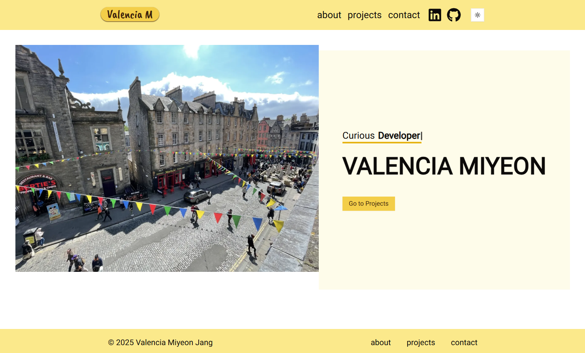

# Valencia M's Portfolio

Welcome to my personal portfolio! This site showcases my work as a front-end developer. It's built using **Next.js**, **React**, and **Tailwind CSS**.

  

## 🚀 Features

- **Responsive Design**: Optimized for all screen sizes.
- **Project Showcases**: View my latest work and GitHub links.
- **Dark Mode**: Switch between light and dark themes for a comfortable viewing experience.

## ⚙️ Technologies

- **Next.js**
- **React**
- **Tailwind CSS**
- **TypeScript**
  **Vercel (Deployment)**

## 📬 Contact

- **Email**: miyeon5230@gmail.com
- **GitHub**: [github.com/valencia0523](https://github.com/valencia0523)
- **LinkedIn**: [linkedin.com/in/valencia0523](https://www.linkedin.com/in/valencia0523)
